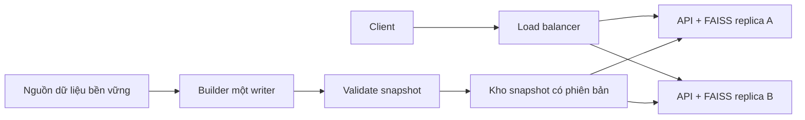

# Đánh giá khả năng mở rộng và chịu lỗi với FAISS

Ngày đánh giá: 2026-09-13. Phạm vi: mã và dữ liệu trong workspace hiện tại, gồm các thay đổi đang có của người dùng. Đây là đánh giá và thiết kế đề xuất; chưa triển khai HA hay thay đổi runtime.

**Kết luận:** có thể tiếp tục dùng FAISS làm lõi truy xuất, nhưng triển khai hiện tại chưa đủ cơ sở cam kết scale hoặc chịu lỗi production. Ưu tiên sửa tính đúng đắn và tính nhất quán của dữ liệu, sau đó triển khai replica đọc với giới hạn tải. Chỉ chuyển loại index hoặc chia shard khi benchmark chứng minh cần thiết.

## 1. Bằng chứng hiện tại

| Hạng mục | Kết quả kiểm tra |
|---|---|
| Thư viện/index thực tế | FAISS 1.14.3; `IndexIDMap(IndexFlatIP)`, dimension 1536 |
| Dữ liệu đã nhúng | 14.500 vector; index 89.204.090 byte (~85,1 MiB) |
| Ánh xạ | 45.823 mục; mọi ID trong index đều có ánh xạ |
| Checkpoint | 14.500 ID, khớp tập ID trong index; không phát hiện ID trùng trong index |
| Thời gian đọc index | ~0,095 giây trong một lần đo; có thể hưởng lợi từ page cache |
| Tìm kiếm đơn lẻ | p50 4,805 ms; p95 5,888 ms; p99 7,009 ms |

Phép đo dùng 100 query ngẫu nhiên chuẩn hóa, seed 42, 5 lượt warm-up, `k=20`, một thread OpenMP, thực hiện tuần tự trên máy workspace. Chỉ đo `index.search`; không bao gồm embedding, metadata, rerank, LLM, mạng hay tải đồng thời. Không dùng kết quả này để suy ra QPS production hoặc ngoại suy tuyến tính sang triệu vector.

Số vector bằng khoảng 31,6% số mục ánh xạ. Pipeline tạo map trước khi embedding, nên chênh lệch có thể do chạy dở hoặc embedding thất bại. Chưa xác minh nguyên nhân hay sự tương ứng về nội dung của từng vector; khớp ID không chứng minh embedding đúng tài liệu. Cần báo cáo coverage và danh sách thất bại trước khi phát hành snapshot.

Các giả định ~3,2 GB/~810k chunks trong tài liệu cloud trước đó không phải số đo của workspace này. Không dùng ngưỡng số vector hoặc chi phí cố định để quyết định chuyển backend.

## 2. Điểm nghẽn và rủi ro

| Ưu tiên | Bằng chứng trong mã | Tác động và xử lý đề xuất |
|---|---|---|
| P0 | `providers/faiss_store.py:56`: lấy top `len(candidates)+5` toàn cục rồi lọc | Không bảo đảm top-k trong tập ứng viên. Tính điểm trực tiếp trên vector ứng viên với ánh xạ ID → vị trí đúng, hoặc dùng bộ lọc tương thích với loại index đã kiểm chứng. Tăng over-fetch đơn thuần không bảo đảm đúng. |
| P0 | `pipeline/chunk_embedding.py`, `phase3_chunk` và `phase4_embedding`: ghi đè từng file; index lưu trước checkpoint | Crash có thể làm file hỏng hoặc checkpoint cũ dẫn đến add trùng ID khi resume. Đóng gói dữ liệu thành snapshot bất biến và commit cả phiên bản. |
| P0 | ID là vị trí `enumerate(all_chunks)`; resume chỉ kiểm tra dimension | Reorder/chỉnh nội dung chunks rồi resume có thể gắn vector cũ với nội dung mới. Dùng ID ổn định, content hash và fingerprint cấu hình embedding; từ chối resume khác thế hệ. |
| P1 | `api/app.py:132`: queue vô hạn, một thread cho mỗi stream; dùng executor chung để chờ queue | Client chậm hoặc upstream treo có thể tích tụ RAM/thread, cạnh tranh với non-stream. Giới hạn request đang chạy, queue và thời gian chờ; xử lý cancellation khi queue đầy. |
| P1 | `providers/reranker.py`: HTTP không có timeout; embedding/LLM dùng cấu hình SDK mặc định | Thiếu ngân sách thời gian end-to-end; cancellation chỉ được kiểm tra giữa các bước không ngắt ngay HTTP đang chạy. Đặt timeout, retry hữu hạn và circuit breaker theo dependency. |
| P1 | `compose.yaml` một service, bind mount local; `/health` luôn trả `ok` sau startup | Không có failover giữa host. Tách liveness/readiness và triển khai replica ở các miền lỗi độc lập. Restart policy không thay thế HA. |
| P1 | `FaissVectorStore.__init__` nạp index/map riêng; `load_search_data` nạp JSON; pipeline tạo khi import | Mỗi process nạp dữ liệu riêng, chưa có validate snapshot hay reload phối hợp. Pin một phiên bản cho toàn bộ index và metadata; readiness chỉ bật sau validation/warm-up. |
| P2 | `services/search.py`, `doc_ref_search`: quét `chunk_map` theo mỗi truy vấn | Chi phí lọc tăng theo tổng chunks. Tạo inverted index theo số hiệu/doc_id/Điều/Khoản và chuẩn hóa khóa trước. |
| P1 | Pipeline chuẩn hóa vector tài liệu nhưng `FaissVectorStore.search` không chuẩn hóa query | Nếu provider không trả unit vector, threshold thay đổi theo norm query. Xác định hợp đồng cosine/IP, chuẩn hóa nhất quán và kiểm tra dimension, NaN, Inf, vector zero. |

Tái hiện lỗi subset độc lập với embedding/LLM: tạo 10 vector 2 chiều đã chuẩn hóa, ID 0–7 là `[1,0]`, ID 8 là `[0,1]`, ID 9 là `[0.1,0.995]`. Query `[1,0]`, candidates `{8,9}`, top-k=2. Kết quả đúng là `[9,8]`; implementation hiện tại trả `[]` vì chỉ xét top-7 toàn cục. Đây là lỗi ở tầng vector store, trước khi áp dụng threshold nghiệp vụ.

Các điểm thuận lợi: runtime chỉ đọc index; metadata được chia sẻ giữa hai search service trong cùng process; giao diện `VectorStore` cho phép thay provider; lịch sử chat nằm trong request. FAISS CPU cho phép tìm kiếm đồng thời trên index không bị sửa; thao tác ghi cần đồng bộ riêng. [Tài liệu FAISS về threading](https://github.com/facebookresearch/faiss/wiki/Threads-and-asynchronous-calls).

## 3. Kế hoạch mở rộng

### Dung lượng

Flat lưu khoảng `4*d` byte/vector; ở d=1536 là 6144 byte. Tìm kiếm Flat duyệt toàn bộ vector. HNSW thêm bộ nhớ graph; IVF giảm phạm vi duyệt; PQ nén vector và đánh đổi độ chính xác. [Các loại index FAISS](https://github.com/facebookresearch/faiss/wiki/Faiss-indexes).

| Số vector | Bộ nhớ vector float32, chưa gồm ID/metadata |
|---|---:|
| 100.000 | 0,572 GiB |
| 1.000.000 | 5,722 GiB |
| 10.000.000 | 57,220 GiB |

Sizing cho hệ thống này phải cộng JSON sau giải mã thành object Python, map hai chiều, thư viện, request đang chạy và buffer. `chunks.json` hiện ~47 MiB trên đĩa không phải mức RSS của dữ liệu đó. Đo cả RSS ổn định và đỉnh khi startup; rollout/hot-swap cần dung lượng cho hai thế hệ nếu cùng tồn tại. Nhiều worker có thể nhân bản index và metadata; không giả định hệ điều hành tự chia sẻ bộ nhớ.

### Theo từng bước

1. **Giữ Flat, tăng năng lực phục vụ đọc:** ít nhất hai replica trên hai host/miền lỗi, mỗi replica giữ bản local của cùng snapshot. Load balancer chỉ gửi tới replica ready. Bắt đầu một process mỗi container, đo thread OpenMP và giới hạn concurrency theo CPU/RAM thực tế. Không scale-to-zero toàn bộ replica khi cần luôn sẵn sàng.
2. **Tối ưu khi chạm SLO:** benchmark HNSW hoặc IVF trên dữ liệu/query đại diện và so recall@k với Flat; thử PQ khi RAM là ràng buộc. Giữ Flat cho tập ứng viên nhỏ và làm baseline. Không đổi sang ANN chỉ vì có thêm người dùng.
3. **Tách retrieval service khi cần:** giữ `services/` phụ thuộc interface và cung cấp provider gọi dịch vụ từ xa. API và retrieval có thể scale độc lập; cache phải có khóa gồm phiên bản snapshot, model và bộ lọc.
4. **Shard khi một node không đáp ứng dung lượng/latency:** định tuyến hoặc fan-out tới shard, lấy top-k mỗi shard rồi merge với cùng metric, model, normalization và thế hệ. Mỗi shard cần replica; không trả kết quả thiếu shard như thể đầy đủ. Với ANN, đo recall toàn cục sau merge. Sharding làm tăng chi phí vận hành và failure modes.

Điều kiện chuyển backend: nhu cầu cập nhật đồng thời, lọc phức tạp, độ tươi dữ liệu, vận hành replication/backup hoặc SLO vượt khả năng đội ngũ. FAISS có thể tiếp tục làm lõi, nhưng lớp dịch vụ phải chịu trách nhiệm phân phối, phiên bản và phục hồi.

## 4. Thiết kế chịu lỗi đề xuất

**Xuất bản snapshot:** writer có khóa/lease, build trong thư mục phiên bản mới. Manifest chứa checksum từng file, schema, model/version, dimension, metric, normalization, số vector, coverage, content fingerprint và checkpoint. Validate ID duy nhất, mọi ID index có metadata/text, checkpoint khớp index, vector hợp lệ và smoke query. Nếu cho phép index một phần, manifest phải ghi rõ và đạt ngưỡng coverage đã đặt; không bắt buộc `len(map)==ntotal` khi map chủ động chứa chunks chưa nhúng.

Ghi đủ file, flush/fsync phù hợp storage và xác minh checksum trước khi cập nhật con trỏ phiên bản. Trên filesystem dùng atomic rename trong cùng filesystem; trên object storage dùng object bất biến và conditional update cho manifest/con trỏ, không giả định rename nguyên tử nhiều object. Loader resolve phiên bản đúng một lần rồi đọc mọi file từ phiên bản đó. FAISS không tự kiểm tra tính toàn vẹn file khi đọc; chỉ nạp artifact đã xác thực từ pipeline tin cậy. [Tài liệu FAISS về index I/O](https://github.com/facebookresearch/faiss/wiki/Index-IO,-cloning-and-hyper-parameter-tuning).

**Rollout/rollback:** replica tải và kiểm tra snapshot, warm-up rồi mới nhận traffic. Giữ phiên bản cũ tới khi request đang chạy kết thúc; pin snapshot cho toàn bộ một request RAG để các tool call không trộn thế hệ. Duy trì snapshot tốt trước đó để rollback. Giai đoạn rollout có thể có request khác nhau dùng phiên bản khác nhau; nếu yêu cầu chuyển đồng loạt, route theo version ở tầng load balancer. Ghi version vào log/trace và kết quả truy xuất nội bộ.

**Phục hồi:** lưu snapshot đã commit và nguồn/chunk/embedding cần thiết ngoài host phục vụ; kiểm thử restore sang node sạch. Mục tiêu đề xuất: không mất snapshot đã xác nhận bền vững (RPO=0 cho snapshot đã commit); dữ liệu nguồn chưa xuất bản có RPO theo chu kỳ ingest cần xác định. RTO failover đề xuất ≤60 giây khi còn replica khỏe; RTO phục hồi toàn cụm phải đo riêng, gồm download, validate, load và warm-up.

**Sự cố upstream và quá tải:** giới hạn concurrency trước khi mở SSE, trả 429/503 khi hết dung lượng; đặt queue hữu hạn và timeout tổng. Retry có jitter trong ngân sách request, tránh retry nhiều tầng. Reranker lỗi có thể giữ thứ tự retrieval nhưng phải ghi trạng thái degraded; embedding lỗi không được coi là “không có tài liệu”. Khi thiếu bằng chứng, phản hồi lỗi retrieval rõ ràng. Không replay mù toàn bộ stream đã phát token khi node chết; client cần biết request chưa hoàn tất.

**Health và quan sát:** liveness phản ánh tiến trình, readiness phản ánh snapshot hợp lệ và worker có thể phục vụ. Theo dõi upstream riêng, tránh restart hàng loạt chỉ vì dịch vụ ngoài bị lỗi. Thu thập latency từng bước, queue wait/depth, active streams, reject/error/timeout rate, CPU/RSS/thread, snapshot version/age, coverage, số lỗi ID mapping và restore duration.

## 5. Tiêu chí nghiệm thu trước khi cam kết scale/HA

Các con số dưới đây là mục tiêu đề xuất, chưa đạt bằng phép đo hiện tại. QPS mục tiêu, concurrency, kích thước corpus, tần suất cập nhật và ngân sách cần được xác định theo tải sử dụng thực tế.

| Kiểm thử | Điều kiện đạt |
|---|---|
| Tính đúng đắn subset | Khớp exact top-k trong tập ứng viên, gồm ứng viên nằm ngoài top toàn cục; kiểm tra ID không liên tục và tie |
| Chất lượng ANN nếu áp dụng | Recall@10 ≥0,98 so với Flat trên bộ query đại diện; đo riêng bộ lọc và đối chiếu trích dẫn |
| Tải tăng dần và soak ≥60 phút | Ở QPS/concurrency mục tiêu: retrieval cục bộ p95 ≤100 ms, lỗi ngoài dự kiến <1%; queue/thread/RSS ổn định. Đo riêng TTFT và thời gian hoàn thành RAG |
| Client chậm/ngắt SSE và upstream treo | Tài nguyên được thu hồi trong deadline; queue không tăng vô hạn; request mới vẫn được phục vụ hoặc bị từ chối có kiểm soát |
| Kill một replica/host dưới tải | Request mới chuyển sang replica khỏe trong ≤60 giây; công suất còn lại đủ tải; stream gián đoạn báo lỗi rõ |
| Kill writer tại các bước lưu | Chỉ snapshot cũ hoặc mới hợp lệ được phục vụ; resume không tạo ID trùng hay ánh xạ sai |
| File thiếu, checksum sai, map lệch, model sai | Snapshot bị từ chối trước readiness; replica cũ tiếp tục phục vụ |
| Rolling update/rollback | Một request luôn dùng một phiên bản; giữ đủ replica ready và không OOM |
| Restore từ backup trên node sạch | Đúng manifest/checksum, đủ dữ liệu, đạt smoke query; ghi RTO thực đo |

Kiểm tra đã thực hiện: đọc mã, kiểm tra ID/checkpoint và phép đo cục bộ ở mục 1; tái hiện lỗi subset; chạy `tests/test_providers.py` và `tests/test_search_service.py`. Chưa chạy load test end-to-end, fault injection, restore hoặc benchmark corpus lớn. Bộ test subset sẵn có chỉ dùng ba vector nên chưa bắt được lỗi over-fetch.

Thứ tự thực hiện: P0 tính đúng đắn + snapshot/checkpoint → P1 giới hạn tải/timeout/readiness → replica và diễn tập failover/restore → benchmark chọn index → shard khi có bằng chứng cần thiết.
